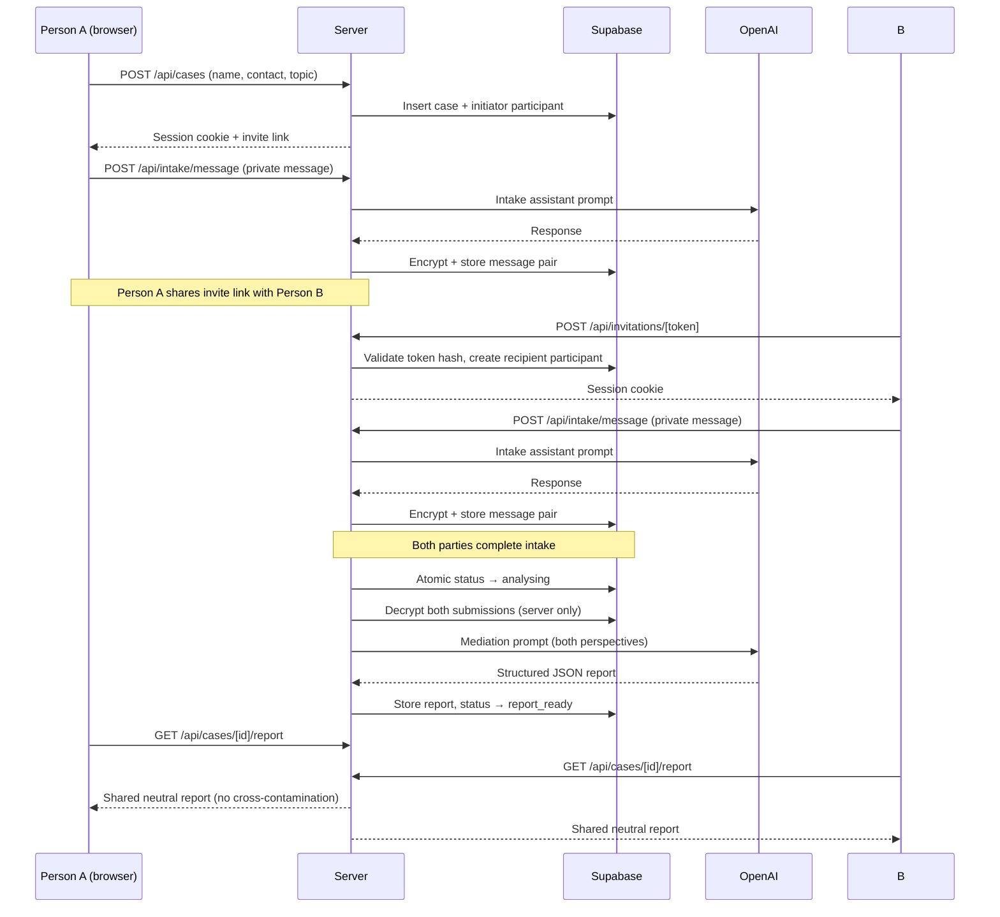

# Common Ground

AI-assisted conflict-resolution facilitation. Each party privately shares their perspective with an AI intake assistant. The AI produces a shared, neutral analysis — never exposing one party's private submission to the other.

## Quick start (demo mode)

```bash
npm install
npm run dev
```

Open [http://localhost:3000](http://localhost:3000). Demo mode is enabled by default (`.env.local` ships with `DEMO_MODE=true`). No external credentials are needed — OpenAI responses are mocked and invite links are printed to the dev server console.

## Tech stack

| Layer | Choice |
|---|---|
| Framework | Next.js 15 App Router, React 19 |
| Language | TypeScript (strict, `noUncheckedIndexedAccess`) |
| Styling | Tailwind CSS with custom Stitch design tokens |
| Database | Supabase Postgres (service-role only, no client DB access) |
| AI | OpenAI GPT-4o with structured JSON output, Zod-validated |
| Auth | Token-based (no accounts), HttpOnly JWT session cookies via `jose` |
| Encryption | AES-256-GCM field-level encryption for all private text |
| Notifications | WhatsApp Cloud API + click-to-chat fallback, Resend email |
| Tests | Vitest (unit) + Playwright (E2E) |
| Deploy | Vercel |

## Environment variables

Copy `.env.example` to `.env.local` and fill in real values:

```bash
cp .env.example .env.local
```

| Variable | Required | Notes |
|---|---|---|
| `NEXT_PUBLIC_APP_URL` | Yes | Full URL of your deployment, e.g. `https://commonground.example.com` |
| `NEXT_PUBLIC_SUPABASE_URL` | Yes | From Supabase project settings |
| `NEXT_PUBLIC_SUPABASE_ANON_KEY` | Yes | From Supabase project settings |
| `SUPABASE_SERVICE_ROLE_KEY` | Yes | From Supabase project settings — **never expose client-side** |
| `OPENAI_API_KEY` | Yes (prod) | From [platform.openai.com](https://platform.openai.com/api-keys) |
| `OPENAI_MODEL` | No | Default: `gpt-4o` |
| `SUBMISSION_ENCRYPTION_KEY` | Yes | 64-char hex string: `node -e "console.log(require('crypto').randomBytes(32).toString('hex'))"` |
| `SESSION_SECRET` | Yes | Base64url string: `node -e "console.log(require('crypto').randomBytes(32).toString('base64url'))"` |
| `CRON_SECRET` | Yes (prod) | Arbitrary secret to protect `/api/cron` endpoints |
| `DEMO_MODE` | No | Set `true` to use mock AI responses |
| `WHATSAPP_PHONE_ID` | No | Meta WhatsApp Cloud API phone number ID |
| `WHATSAPP_ACCESS_TOKEN` | No | Meta WhatsApp Cloud API access token |
| `RESEND_API_KEY` | No | [Resend](https://resend.com) API key for email fallback |
| `RESEND_FROM_EMAIL` | No | Verified sender address for Resend |

## Database setup

### Supabase

1. Create a new Supabase project.
2. Run the migration:

```bash
# In the Supabase SQL editor, paste and run:
supabase/migrations/001_initial_schema.sql
```

Or with the Supabase CLI:

```bash
supabase db push
```

### Seed (development)

There is no automated seed script — demo mode with mock AI is sufficient for local development.

## npm scripts

| Command | Description |
|---|---|
| `npm run dev` | Start development server |
| `npm run build` | Production build |
| `npm run start` | Start production server |
| `npm run typecheck` | TypeScript type checking |
| `npm run lint` | ESLint |
| `npm run test` | Vitest unit tests |
| `npm run test:e2e` | Playwright E2E tests |

## Deploy to Vercel

1. Push your repository to GitHub.
2. Import the project in [Vercel](https://vercel.com).
3. Add all environment variables from the table above under **Settings → Environment Variables**.
4. Deploy. Vercel auto-detects Next.js and sets the correct build command.

## WhatsApp Cloud API setup

Level 1 (click-to-chat, no credentials needed) works out of the box. For Level 2 (direct API send):

1. Create a [Meta for Developers](https://developers.facebook.com) app.
2. Enable the WhatsApp product.
3. Copy the **Phone Number ID** → `WHATSAPP_PHONE_ID`.
4. Generate a System User token → `WHATSAPP_ACCESS_TOKEN`.
5. Add the recipient's number to the test recipient list during development.

## Architecture

```
Browser
  └── Next.js App Router
        ├── Server components (fetch case/report data, pass to client)
        ├── Client components (chat UI, forms, polling)
        └── Route handlers (API)
              ├── /api/cases          — create case, set session cookie
              ├── /api/invitations    — validate & accept invite token
              ├── /api/intake/*       — AI chat, history, summary, complete
              └── /api/cases/[id]/*   — status, analyse, report, agreement, feedback
```

## Data flow



## Security model

- **Token-based access**: no user accounts. Each participant holds a cryptographically random token (32 bytes). Only SHA-256 hashes are stored in the database.
- **Field-level encryption**: all intake messages and submission summaries are encrypted with AES-256-GCM before storage. The key (`SUBMISSION_ENCRYPTION_KEY`) never leaves the server.
- **Session cookies**: HttpOnly, Secure (in production), SameSite=Strict. JWT signed with `SESSION_SECRET`.
- **Cross-participant isolation**: the report API verifies the session belongs to the case. Intake history only returns the caller's own messages. The invitation endpoint returns only topic and names — never private content.
- **No private text in URLs, logs, or notifications**: the analysis pipeline decrypts both submissions server-side only, merges them into the AI prompt, and discards the plaintext.
- **Safety classification**: every AI report includes a `safetyCategory`. Four sensitive categories (`possible_coercion_or_abuse`, `possible_self_harm_or_violence`, `possible_child_safety_issue`, `legal_or_professional_support_needed`) route participants to a SafetyScreen with resources, bypassing the mediation advice.

## Testing

```bash
# Unit tests (no external dependencies)
npm run test

# E2E tests (starts dev server automatically)
# Tests 2 & 3 require a real Supabase instance.
# All other tests run against demo mode only.
npm run test:e2e
```

## Accessibility

- Colour contrast meets WCAG AA at all text sizes.
- All interactive elements have visible focus rings and ARIA labels.
- `prefers-reduced-motion` suppresses animations.
- Forms use `<label for>` associations and native validation.
